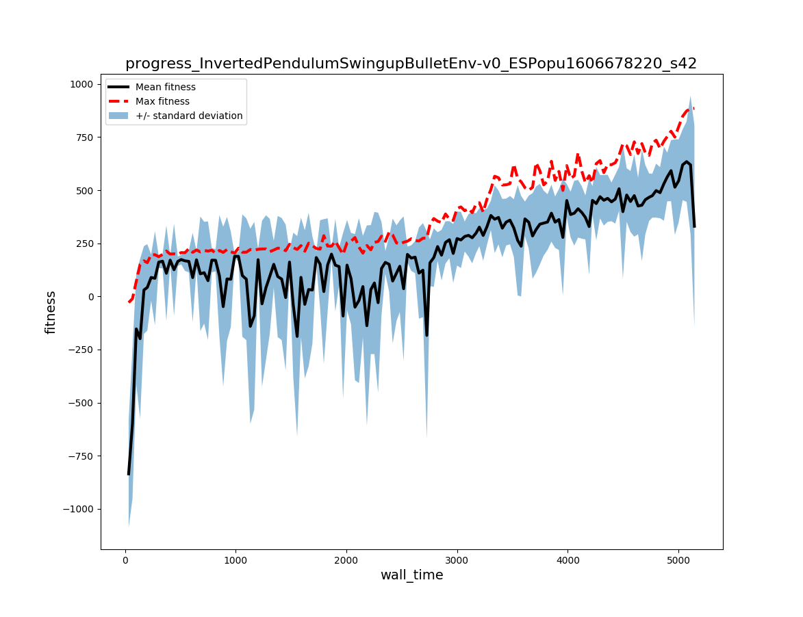
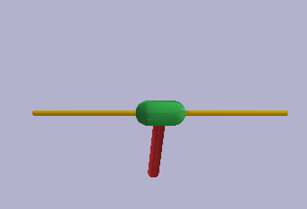

# Bootstrapping Deep Neuroevolution and Developmental Learning

This project is a resource for experiment and self-study for evolutionary and developmental algorithms, particularly in the context of reinforcement learning tasks and the quest to understand intelligence. This document contains instructions for installing and getting started with experiments, for introductory and tutorial essays see the [BevoDevo Guide](./guide.md).

[Spinning Up](https://spinningup.openai.com) by [Joshua Achiam](https://github.com/jachiam) was a noteworthy inspiration and spiritual predecessor to this project, and the associated [repository](https://github.com/openai/spinningup) is an exceptional resource. 

## Installation

I'll assume you've already installed Python and leave the choice of virtual environment package manager to you. I personally prefer [`virtualenv`](https://virtualenv.pypa.io/en/stable/) but [Anaconda](https://anaconda.org/) is also popular. I use the following commands to create and activate a BevoDevo virtual environment.

```
virtualenv bevo_env --python=python3
source spinup_env/bin/activate
```

Evolutionary algorithms tend to be "[embarrassingly parallel](https://en.wikipedia.org/wiki/Embarrassingly_parallel)" BevoDevo uses [OpenMPI](https://www.open-mpi.org/) and `mpi4py` for message passing between multiple threads. To install OpenMPI on Ubuntu 

```
sudo apt update
sudo apt install -y libopenmpi-dev cmake build-essential swig
``` 

I haven't tested this project on other operating systems and so I can't vouch for installation on Windows or MacOS, but [Spinning Up](https://spinningup.openai.com/en/latest/user/installation.html#installing-openmpi) instructs it's  `brew install openmpi` to install OpenMPI on Mac. 

Next clone and install `bevodevo` and all dependencies

```
git clone https://github.com/rivesunder/bevodevo
cd bevodevo
pip install -e .
```

BevoDevo uses [PyTorch](https://pytorch.org/get-started/locally/) as the main deep learning library (though most of the selection and population updating functionality relies only on NumPy). Most algorithms run pretty well on the CPU, but for some image-based environments you may want to make sure you have [CUDA](https://developer.nvidia.com/cuda-downloads) installed and working with pytorch (check `import torch; torch.cuda.is_available()` in Python).

After installing OpenMPI and BevoDevo, you should be ready to test whether your efforts were successful by running an experiment. 

```
python bevodevo/train.py -n InvertedPendulumSwingupBulletEnv-v0 -p 128 \
    -a ESPopulation -pi MLPPolicy -g 50 -x test_exp -s 42   
```

When your experiment finishes, you can plot the training curve with

```
python bevodevo/plot.py -f results/test_exp/
```

or watch the agent deal with the environment 

```
python bevodevo/enjoy.py -n InvertedPendulumSwingupBulletEnv-v0 -fp ./results/test_exp/
```

<div align="center">

<br><br>


