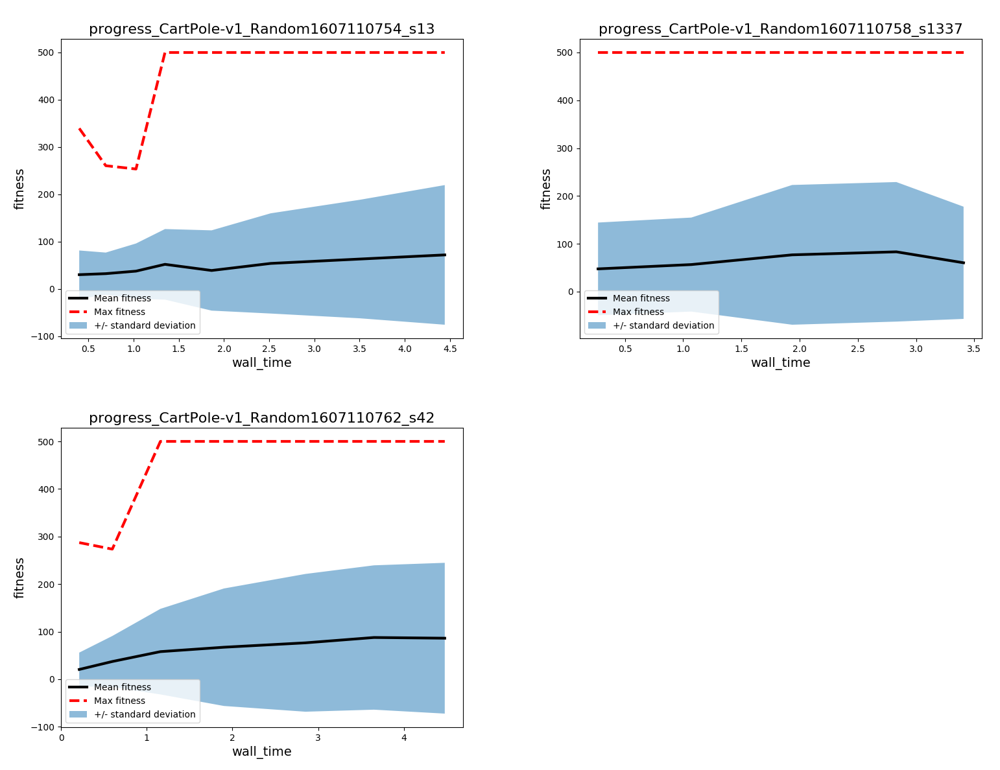
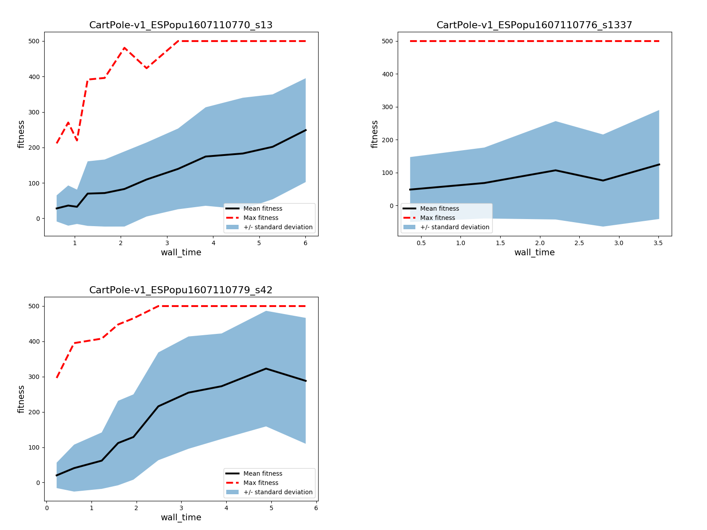
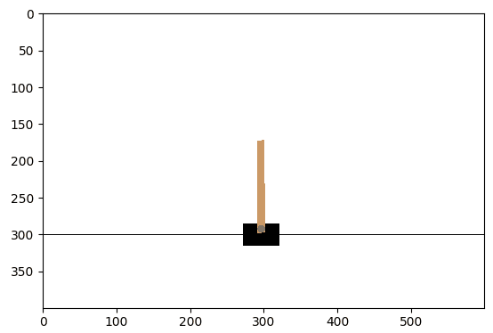
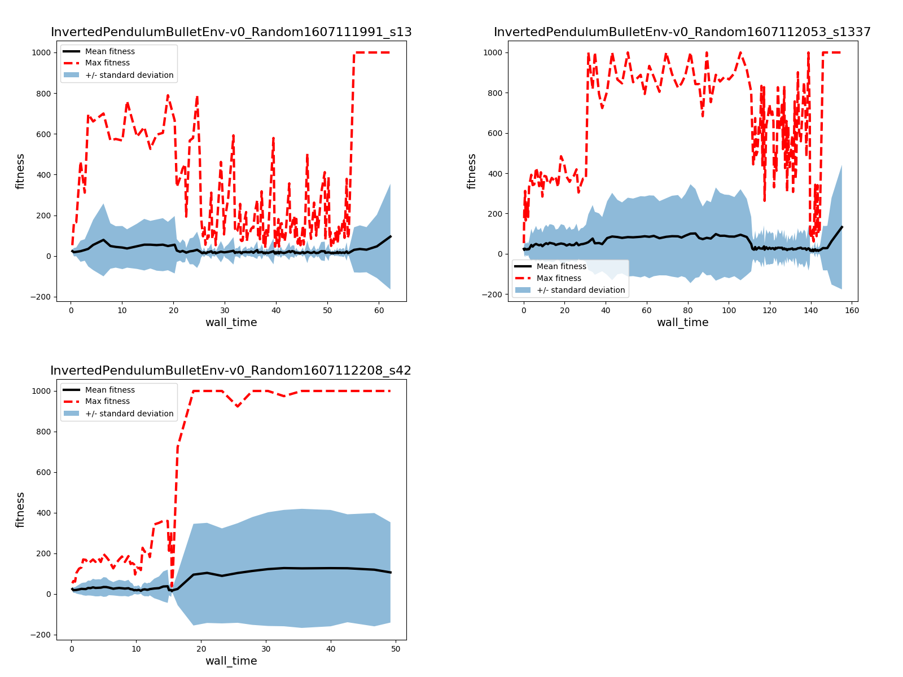
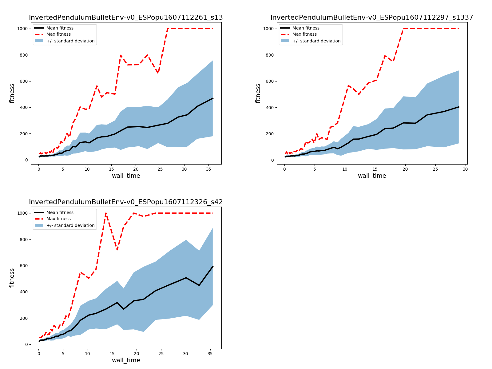
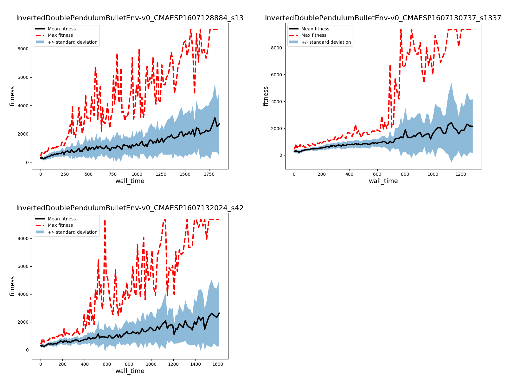
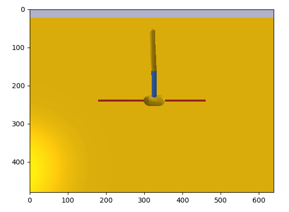
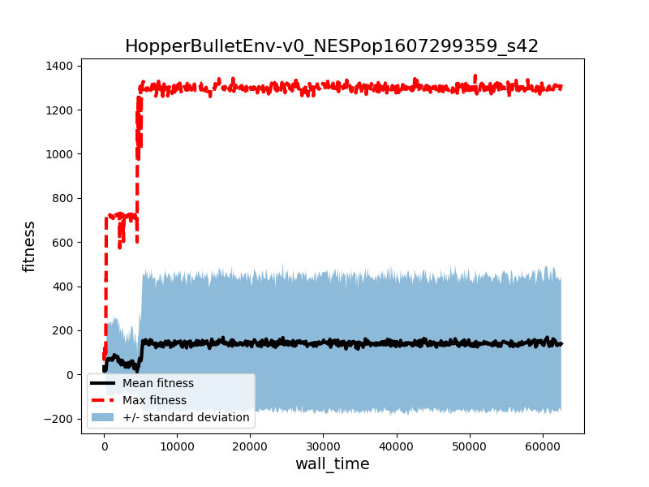

# Evo/Devo Examples

## CartPole

CartPole, and inverted pendulum balancing tasks in general, are relatively simple classic control problems. The version implemented in OpenAI gym has a discrete action space. When using CartPole to test learning algorithms solving the task may not tell you very much, but failing does. Take a look at the learning curve for random search to get an idea why that is.

<div align="center">

<br>
<em>Random search applied to the CartPole problem with 3 different psuedorandom number generator seeds.</em>
<br>
</div>

You can see in the figure above that my RandomSearch baseline solves CartPole in less than 5 seconds. The experimental settings can be replicated with the call to `bevodevo.train`below.

```
# at commit 06676789
python -m bevodevo.train -a RandomSearch -n CartPole-v1 -g 2500 \
-w 40 -t 499.0 -pi MLPPolicy -p 80 -s 13 1337 42
```

Using simple Gaussian evolution strategies also finds an answer quickly, but there's no real advantage over a random search.

<div align="center">

<br>
<em>Simple Gaussian evolution strategies applied to CartPole.</em>
<br>
</div>

```
# at commit 06676789
python -m bevodevo.train -a ESPopulation -n CartPole-v1 -g 2500 \
-w 40 -t 499.0 -pi MLPPolicy -p 80 -s 13 1337 42
```

Watching a trained agent apply its solution policy is about as exciting as you might expect.

<div align="center">

<br>
<em>Solution found with a simple Gaussian evolution strategy.</em>
<br>
</div>

## InvertedPendulumBulletEnv

A version of the pole-balancing problem with a continuous action space, implemented in PyBullet. The continuous action space makes for a slightly more difficult task. Random search still does manage to stumble upon the answer, but the slightly more clever simple Gaussian evo. strategy finds solutions faster and more reliably.  

<div align="center">

<br>
<br>
</div>

```
# at commit 06676789
python -m bevodevo.train -a RandomSearch -n InvertedPendulumBulletEnv-v0 -g 2500 \
-w 40 -t 499.0 -pi MLPPolicy -p 80 -s 13 1337 42

```

<div align="center">

<br>

<br>
<br>
</div>

```
# at commit 06676789
python -m bevodevo.train -a ESPopulation -n InvertedPendulumBulletEnv-v0 -g 2500 \
-w 40 -t 499.0 -pi MLPPolicy -p 80 -s 13 1337 42
```

## InvertedDoublePendulumBulletEnv

A slightly more difficult balancing task can be had by adding a joint to the pole to be balanced.

<div align="center">

<br>

<br>
<br>
</div>

```

# at commit 06676789
python -m bevodevo.train -a CMAESPopulation -n InvertedDoublePendulumBulletEnv-v0 -g 250 \
-w 40 -t 9200.0 -pi MLPPolicy -p 80 -s 13 1337 42
```

## HopperBulletEnv

Now getting into simplified robotic locomotion tasks, `HopperBulletEnv-v0` is a 2D, single-legged forward movement task with a large foot. In my experience, 2D locomotion RL tasks are somewhat misleading in terms of their difficulty. While agents don't have to avoid falling over perpendicular to the direction of travel, with two legs (or a big foot) it's easy to get stuck in a local minimum of just standing still. 


<div align="center">

<br>

<br>
<br>
</div>

```
# at commit a0beb6124
python -m bevodevo.train -a NESPopulation -n HopperBulletEnv-v0 -g 650 \
-w 0 -pi MLPPolicy -p 320 -s 42
```
