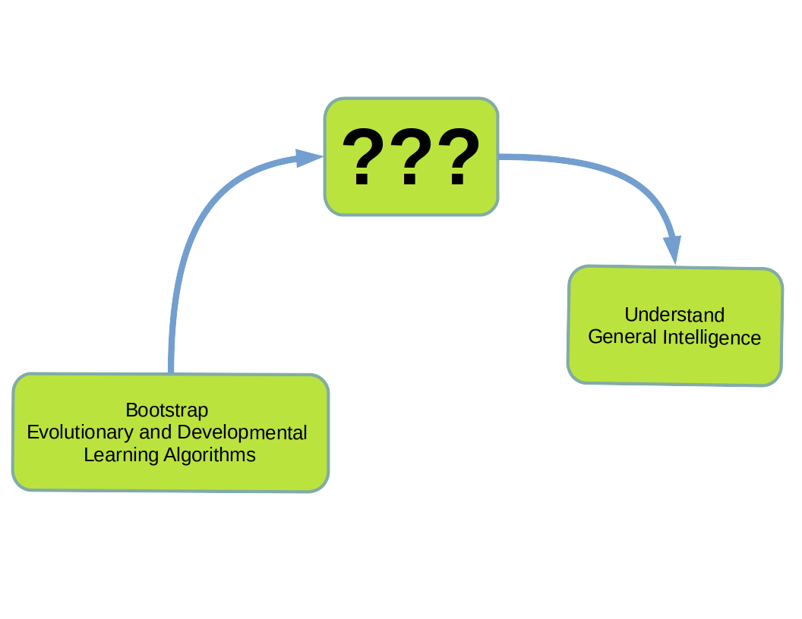

# Bootstrapping Deep Evolutionary and Developmental Learning

## Table of contents

1. [Introduction](#introduction)
    1. [Why?](#why)
    1. [What?](#what)
1. [Getting Started](#getting-started)
    1. [Installation](#installation)
    1. [Running Experiments](#running-experiments)
    1. [Visualizing Experimental Results](#visualizing-experimental-results)
1. [EvoDevo Examples](./examples.md)
1. [EvoDevo Reading List](#evodevo-reading-list)

## _Release Status and Roadmap_

Bootstrapping Deep Evolutionary and Developmental Learning is an ongoing project, currently released at an _alpha_ stage. That means lots of sharp edges, some missing or unconnected functionality, inevitable bugs, and plenty of room to affect the direction of the project going forward. If you find an issue or have a suggestion for a new feature or algorithm, your addition to this project's issues list posts is very welcome.  

Project priorities include adding tutorials and exercises, increasing the scope of developmental algorithms available, and improved utility (for example by exposing more functionality to `train`). And bug removal, naturally. 

Candidate algorithms for implementation in `bevodevo` include:

* NEAT/HyperNeat
* HyperNetworks
* WANNs
* Population Based Training
* Map-Elites/Quality Diversity
* PGENs
* Automatic Cellular Policies

<div align="center">

</div>

## Introduction

### Why?

Evolution is a fascinating example of unpredictable complexity arising from simple rules. It also is capable of generating machines that are orders of magnitude more efficient than any human-engineered alternative, with the capacity for intelligence in the human brain demanding only 20 Watts (or perhaps ~150 Watts if we include all supporting functionality) a prime example. All this from a set of rules that can essentially be boiled down to a less catchy version of the [classic refrain](https://en.wikipedia.org/wiki/Que_Sera,_Sera_(Whatever_Will_Be,_Will_Be) from stoic philosophy.

<blockquote><em>ce qui sera très probablement, sera très probablement</em></blockquote>

In other words, evolution selects for whatever traits are most likely to persist in a given context. There are no guarantees that the process builds toward intelligencei or even increasing complexity, and it's readily apparent in our current epoch that selective pressure varies incredibly depending on context.  

Evolutionary Computation has a long history, beginning at about the same time as the field of artificial intelligence was named<a href="#fn1">[\*](#fn1)</a> and roughly concurrently with the first wave of artificial neural networks[\*\*](#fn2). There are many types of algorithms loosely based on ideas from evolution: genetic algorithms, evolutionary programming, and evolutionary strategies to name a few. We'll broadly refer to all of these as evoutionary computation (EC). Recently there has been a resurgence in EC research, largely as a side-effect of the massive renaissance in neural networks we've seen in the deep learning era. EC offers a number of advantages over machine learning in neural networks based on backpropagation, as well as many challenges. While EC may be an attractive alternative to other machine learning or optimization methods for some tasks, particularly open-ended or reinforcement learning style tasks, that's not the only reason to study the field. 

Perhaps an equally valid reason to study EC and evolution in general is for the mental tools it provides. Human capacity for different types of thinking is influenced by what they think about, most notably for our purposes the technology of the day. People with ample access to computers are likely to think about problems and their own mental processes via analogy to computational systems[\*\*\*](#fn3). Studying evolutionary computation may give you fresh mental models for dealing with new problems. This adds beneficial diversity to your cognitive tools, and as we'll learn from studying evolution and EC, a larger population is more likely to yield fitter solutions by avoiding random fixation of traits, typical for small populations. This is part of the reason that island populations look so strange: while they are actually [less diverse](https://www.nature.com/articles/hdy199746) than continental populations, they evolve bizarre traits heavily influenced by randomness and characteristics of the founding population.  

Thinking in evolutionary terms can yield valuable insights into modern problems. It's not just about learning to control a robot or play arcade games: antibiotic resistance, emerging zoonotic diseases, ecological robustness, and environmental consequences of the anthropocene are clear and present problems which stand to benefit from thinking in evolutionary, and evolutionary computational, terms. 


### What?

Bootstraping Deep Evolutaionary and Developmental Learning (`bevodevo` for short) is a resource developed for the study of and experimentation with evo/devo algorithms. The main focus is on tasks formulated in the framework of reinforcement learning, an attractive field of machine learning for it's familiarity with intuitive ideas about how learning occurs to maximize desired rewards.

## Getting Started

### Installation

Installation of `bevodevo` and dependencies is explained in the [README.md](./README.md).

### Running Experiments

The entry point for running experiments is `./bevodevo/train.py`. You can call `train` from the command line with no flags to use the default parameters, but you'll probably want to at least specify the environment and the algorithm. For example

```
python bevodevo/train.py -a NESPopulation -n AntBulletEnv-v0
```

begins an experiment training the default MLP policy on the Ant task in PyBullet with natural evolution strategies. Other command line options which may be of interest are:

* `-p` or `--population` - The number of individuals in the training population. 
* `-g` or `--generations` - The maximum number of generations (or epochs for RL algorithms) to train.  
* `-x` or `--exp\_name` - The name under which to save the experimental results. The default for this option is temp_exp.
* `-s` or `--seeds` - Seeds for initializing pseudorandom number generators. You can use multiple integer values for this flag, separated by spaces, and `train` will run the experiment from scratch for each seed. 
* `-pi` or `--policy` - The policy architecture to use. The default is MLPPolicy, and that is the policy that has been used for testing most often and should have the least bugs.
* `-w` or `--workers` - Number of worker threads to use when collecting trajectories.  
* `-n` or `--env\_name` - The name of the RL environment to train on. Default is `InvertedPendulumBulletEnv-v0`
* `-a` or `--algorithm` - Name of the algorithm to use for training. Currently available algos incluce (in approximate order of complexity):
    * RandomSearch - Search randomly from a single mean=0 distribution and save the policies with the best all-time fitness scores.
    * ESPopulation - A Gaussian evolution strategies algorithm that updates the means of the parameters distribution based on the elite 12.5% of agents. 
    * GAPopulation - A simple genetic algorithm with 3 types of mutation (pruning, changing value, and recombination)
    * PGESPopulation - Policy gradient evolution strategy
    * NESPopulation - Natural evolution strategy
    * CMAESPopulation - Covariant matrix adaptation evolution strategy

### Visualizing Experimental Results

After running an experiment you'll probably want to have a look at the results. Currently `bevodevo` has built in plotting for training curves and a utility for visualizing and/or evaluating agent performance. 

A simple training curve can be produce with `plot.py`.

```
python bevodevo/plot.py -f results/test_exp/
```

Plotting has limited functionality right now, but you can point the script to the folder containing your progress log(s) and change the dependent variability to compare performance with respect to different parameters, <em>e.g.</em> sample efficiency or wall time. You can also ask the script to save the plot for you with `-s` or `--save\_fig`. For example, you can plot and save figures for fitness w.r.t. the total steps taken by all individuals in a population throughout training by calling

```
python bevodevo/plot.py -f results/test_exp -x total_env_interacts -s True
```

It doesn't matter what argument you give to `-s` (even `0` or `False`) so long as you include the flag in the command it will change `args.save\_fig` to `True`.


You can also visualize the performance of your top policy, and save frames for making animations if you wish, using `enjoy.py`


```
python bevodevo/enjoy.py -n InvertedPendulumSwingupBulletEnv-v0 -fp ./results/test_exp/
```

You can evaluate over multiple runs by setting the `-e` or `--episodes` flag to a desired number of episodes. `-nr` or `-no\_render` is useful to run evaluations quickly without rendering the environment, but you can expect lower quality images if you use this flag with `-s` to save frames without displaying them (for PyBullet environments at least). You can also limit the number of steps per episode with `-ms` or `-max\_steps`. Finally, make sure that your policy matches the policy used during training. This can be set using the `-pi` flag. 


## Evo/Devo Reading List

This list will expand concomitantly with newly implemented algorithms and features in `bevodevo`. 

1. Papers
	1. A. Soltoggio, K. O. Stanley, and S. Risi, “Born to Learn: the Inspiration, Progress, and Future of Evolved Plastic Artificial Neural Networks,” Neural Networks, vol. 108, pp. 48–67, Dec. 2018, doi: 10.1016/j.neunet.2018.07.013.

	1. N. Hansen and A. Ostermeier, “Completely Derandomized Self-Adaptation in Evolution Strategies,” Evolutionary Computation, vol. 9, no. 2, pp. 159–195, Jun. 2001, doi: 10.1162/106365601750190398.

	1. K. O. Stanley, “Compositional pattern producing networks: A novel abstraction of development,” Genet Program Evolvable Mach, vol. 8, no. 2, pp. 131–162, Jun. 2007, doi: 10.1007/s10710-007-9028-8.

	1. F. P. Such, V. Madhavan, E. Conti, J. Lehman, K. O. Stanley, and J. Clune, “Deep Neuroevolution: Genetic Algorithms Are a Competitive Alternative for Training Deep Neural Networks for Reinforcement Learning,” arXiv:1712.06567 [cs], Apr. 2018, Accessed: Jan. 02, 2020. [Online]. Available: http://arxiv.org/abs/1712.06567.

	1. Y. Sun, D. Wierstra, T. Schaul, and J. Schmidhuber, “Efficient natural evolution strategies,” in Proceedings of the 11th Annual conference on Genetic and evolutionary computation - GECCO ’09, Montreal, Qu&#233;bec, Canada, 2009, p. 539, doi: 10.1145/1569901.1569976.

	1. T. Salimans, J. Ho, X. Chen, S. Sidor, and I. Sutskever, “Evolution Strategies as a Scalable Alternative to Reinforcement Learning,” arXiv:1703.03864 [cs, stat], Sep. 2017, Accessed: Jan. 02, 2020. [Online]. Available: http://arxiv.org/abs/1703.03864.

	1. T. Schaul, T. Glasmachers, and J. Schmidhuber, “High dimensions and heavy tails for natural evolution strategies,” in Proceedings of the 13th annual conference on Genetic and evolutionary computation - GECCO ’11, Dublin, Ireland, 2011, p. 845, doi: 10.1145/2001576.2001692.

	1. S. Risi and K. Stanley, “Indirectly Encoding Neural Plasticity as a Pattern of Local Rules,” in From Animals to Animats 11, vol. 6226, Berlin, Heidelberg: Springer Berlin Heidelberg, 2010, pp. 533–543.

	1. D. Wierstra, T. Schaul, J. Peters, and J. Schmidhuber, “Natural Evolution Strategies,” in 2008 IEEE Congress on Evolutionary Computation (IEEE World Congress on Computational Intelligence), Hong Kong, China, Jun. 2008, pp. 3381–3387, doi: 10.1109/CEC.2008.4631255.

	1. F. Sehnke, C. Osendorfer, T. Rückstieß, A. Graves, J. Peters, and J. Schmidhuber, “Parameter-exploring policy gradients,” Neural Networks, vol. 23, no. 4, pp. 551–559, May 2010, doi: 10.1016/j.neunet.2009.12.004.

	1. D. Grbic and S. Risi, “Safe Reinforcement Learning through Meta-learned Instincts,” arXiv:2005.03233 [cs], May 2020, Accessed: Dec. 02, 2020. [Online]. Available: http://arxiv.org/abs/2005.03233.

	1. S. Yi, D. Wierstra, T. Schaul, and J. Schmidhuber, “Stochastic search using the natural gradient,” in Proceedings of the 26th Annual International Conference on Machine Learning - ICML ’09, Montreal, Quebec, Canada, 2009, pp. 1–8, doi: 10.1145/1553374.1553522.

	1. N. Hansen, “The CMA Evolution Strategy: A Tutorial,” arXiv:1604.00772 [cs, stat], Apr. 2016, Accessed: Nov. 25, 2019. [Online]. Available: http://arxiv.org/abs/1604.00772.

2. Other Resources (Blogs, Lectures, and Science Fiction)

    1. Ha, David. "A Visual Introduction to Evolution Strategies." 2017 Blog Post. [https://blog.otoro.net/2017/10/29/visual-evolution-strategies/](https://blog.otoro.net/2017/10/29/visual-evolution-strategies/) archived version [https://web.archive.org/web/20201111215040/https://blog.otoro.net/2017/10/29/visual-evolution-strategies/](https://web.archive.org/web/20201111215040/https://blog.otoro.net/2017/10/29/visual-evolution-strategies/)

    1. Weng, Lillian. "Evolution Strategies." 2019 Blog Post. [https://lilianweng.github.io/lil-log/2019/09/05/evolution-strategies.html](https://lilianweng.github.io/lil-log/2019/09/05/evolution-strategies.html). Archived: [https://web.archive.org/web/20201001004805/https://lilianweng.github.io/lil-log/2019/09/05/evolution-strategies.html](https://web.archive.org/web/20201001004805/https://lilianweng.github.io/lil-log/2019/09/05/evolution-strategies.html)

    1. Chen, Peter. Deep RL Bootcamp Lecture 8: Derivative Free Mehtods. [https://www.youtube.com/watch?v=SQtOI9jsrJ0](https://www.youtube.com/watch?v=SQtOI9jsrJ0)

    1. Egan, Greg. <span style="text-decoration: underline">Crystal Nights</span>. Available Online: [https://www.gregegan.net/MISC/CRYSTAL/Crystal.html](https://www.gregegan.net/MISC/CRYSTAL/Crystal.html) Archived: [https://web.archive.org/web/20201111183927/https://www.gregegan.net/MISC/CRYSTAL/Crystal.html](https://web.archive.org/web/20201111183927/https://www.gregegan.net/MISC/CRYSTAL/Crystal.html)


